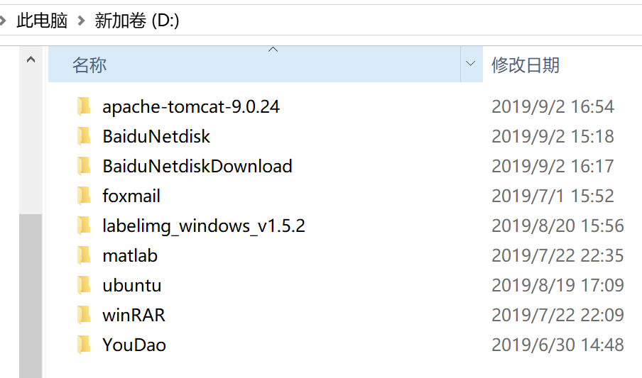
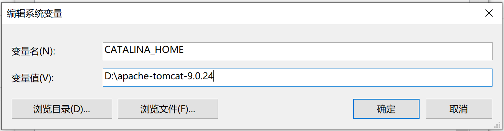
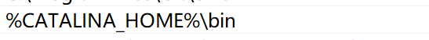
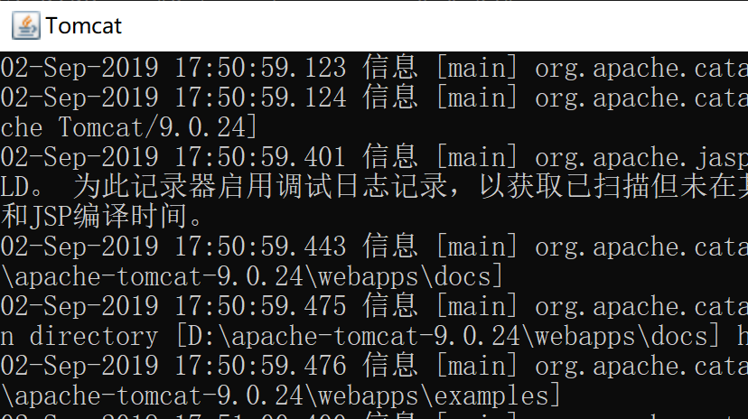
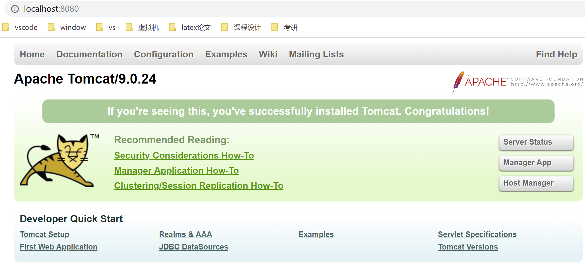
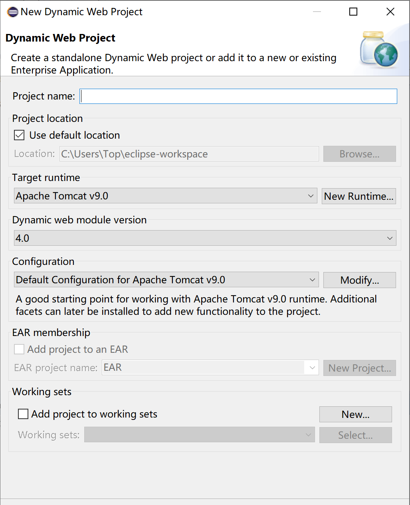

# 服务器搭建文档说明（一）

### 环境要求

tomcat+javaweb+tensorflow环境

### tomcat的安装配置

- tomcat官网下载zip包，解压到除了c盘意外的任何盘。一定不能装在c盘，不要因为软件权限问题后续服务器运行时会报错

- 配置环境变量

  

  其中变量值为当前tomcat压缩包所在位置

  

  在Path中添加tomcat的bin路径，如图所示

- 验证tomcat安装成功与否

  打开cmd，输入命令startup.bat,若弹出小黑窗，打开浏览器输入localhost:8080, 看到页面如图，则安装成功

  

  

  ### javaweb项目建立

- 我们使用的是eclipse进行javaweb的开发。在菜单中，点击顺序为File->new->Other->Web->Dynamic Web Project

- 进行tomcat的配置

  

  next直到这一步，勾选生成web.xml，之后需要进行配置

  

  ### java 的tensorlfow环境配置

- 参考教程<https://tensorflow.google.cn/install/lang_java>

- jar包的放置

  右键点击工程->build path，将jar包复制到webcontent的web-inf的lib文件夹中，将该路径下的tensorflow的jar包add到工程中

- jin文件的放置

  将下载好的zip包解压并复制到src目录下，点击duild path的source，点击src并edit，将链接指向src的解压好的cpu文件夹

  
