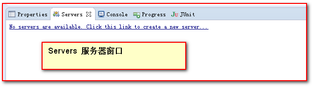
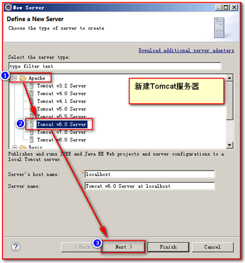
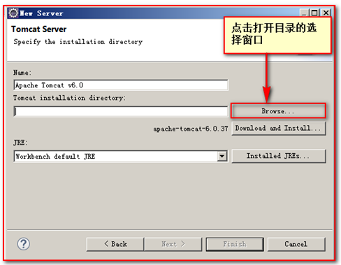
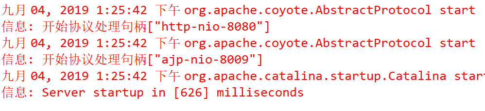
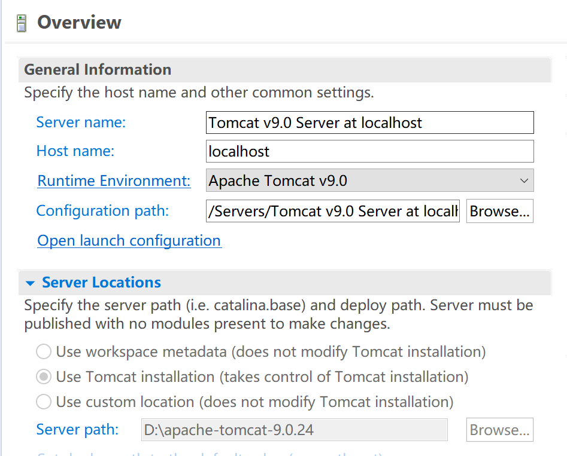

# 服务器搭建说明文档（三）

### 项目部署

javaweb项目运行需要添加server和将项目部署到tomcat上

+ 方法一，将网站目录复制到tomcat/webapps目录下
+ 方法二，将网站目录压缩成war包部署到tomcat下
  + 项目压缩成zip格式
  + 修改文件后缀为.war
  + 把war文件复制到webapps目录下，tomcat会自己把war文件进行解压

### 在eclipse中创建服务器

  + 点击window->show view->servers
   
  server服务器窗口成功打开
   
  + 点击文本链接，创建一个新的tomcat服务器实例
   
  选择tomcat服务器时应与安装的tomcat版本一致
  + 将tomcat的安装路径载入
   
  + 启动tomcat服务器实例 
  点击文本链接，服务器启动成功，控制台输出信息
  

### 配置tomcat部署的web工程路径

+ 双击创建好的服务器示例，打开配置窗口如下
  
+ server locations中我选择的是第二个选项，使用tomcat installation，方便之后对模型文件的路径读取