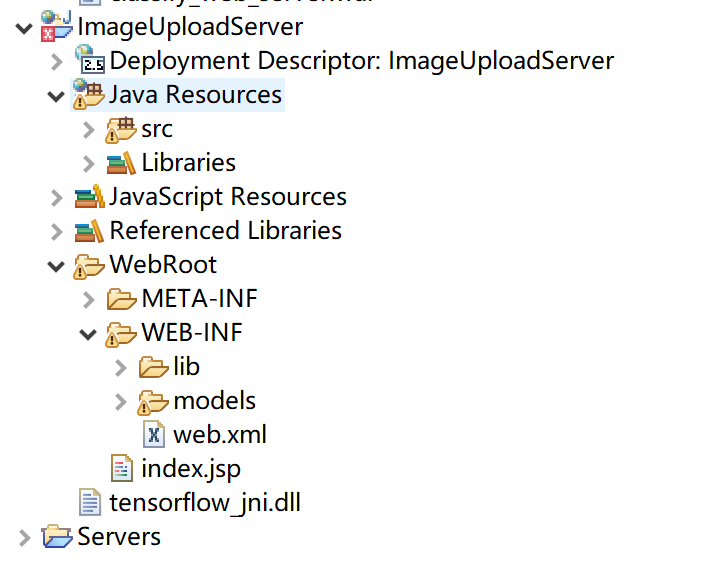

# 服务器搭建说明文档（四）
### 服务器测试
在完成了服务器的搭建步骤和代码改写之后，便和安卓端进行了服务器的接受和处理功能测试

+ 项目目录
    
    我们的javaweb工程为ImageUploadServer,工程目录如下

    
    
    + 在图中servlet在src中，当运行服务器时，servlet中的Get方法不断的检测是否有安卓端发来的http请求，并进行处理和返回结果
    + 项目运行时，目录处在tomcat安装目录下，webroot下的web-inf下，有子文件夹lib和models，lib中是项目运行所需的jar资源包，models则是tensorflow的模型文件夹
  
+ 服务器更改
  
    + 原来的服务器版本为classify_web_server，配置了java调用tensorflow的所有环境，但在和安卓端进行测试的时候，报了很多的错。我们对错误进行了解决，但是安卓端的程序崩掉了。由于时间的不足，安卓端的程序借鉴了网上的代码，于是服务器大改版
    + 在服务器改版之后，服务器能接收到安卓传来的图片，并进行保存。
    ```
    // 上传图片文件
	private void uploadImage(HttpServletRequest request, HttpServletResponse response) 
			throws ServletException, IOException {
		String message = "";
		
		//research文件夹路径
		research=request.getSession().getServletContext().getRealPath("/")+
				"WEB-INF"+File.separator+"models"+File.separator+"research"+File.separator;
		System.out.println(research);
		try{
			DiskFileItemFactory dff = new DiskFileItemFactory();
			ServletFileUpload sfu = new ServletFileUpload(dff);
			List<FileItem> items = sfu.parseRequest(request);
			// 获取上传字段
			FileItem fileItem = items.get(0);
			// 更改文件名为唯一的
			String filename = fileItem.getName();
			if (filename != null) {
				filename = IdGenertor.generateGUID() + "." + FilenameUtils.getExtension(filename);
			}
			// 生成存储路径
			String storeDirectory = research+"test_images";
			System.out.println(storeDirectory);
			
			File file = new File(storeDirectory);
			
			//生成图片存储文件夹目录
			if (!file.exists()) {
				file.mkdir();
			}
			
			//图片所在文件夹
			String path = genericPath(filename, storeDirectory);		

			// 处理文件的上传
			try {
				fileItem.write(new File(storeDirectory + path, filename));
				
				String filePath;
				//图片路径
				filePath =storeDirectory + path + File.separator + filename;
				
				System.out.println(filePath);
				
				//得到最后的结果label
				
				String finalLabel=usePython(research,storeDirectory+path);
				message=finalLabel;
				System.out.println(finalLabel);
				
			} catch (Exception e) {
				message = "上传图片失败";
			}
		} catch (Exception e) {
			message = "上传图片失败";
		} finally {
			response.getWriter().write(message);
		}
	}
    
    ```
    + 我们的图片会保存在models/research/test_images/下，便于之后调用模型对图片进行推理
+ java调用python
  
  + 原本的打算是通过参考tensorflow的官方示例，使用java调用模型对图片进行推理。服务器能接收到安卓端传来的图片，在使用java调用模型时，报错can not find the tensorflow library
  + 网上查询发现，说是tensorflow_jni.dll文件位置放置不对，一开始的教程说是放在src下，报错，于是我们将该dll文件按照教程放在了c:\window\system32下，运行程序仍旧报错。有的说放在跟src的同级目录下，还是报相同的错误
  + 最后我们决定使用python调用模型对图片进行推理，在java中运行python并接收其输出结果
  ```
  //Java调用python程序
	private String usePython(String dir,String path){
		String pythonDir=dir+"get_test_result.py";
		
		System.out.println(pythonDir);
		System.out.println(image);  
		
		Process pro;
		String result="";
		
		String [] arg=new String[] {"python",pythonDir,image};
		
		try {
			//执行python文件
			pro=Runtime.getRuntime().exec(arg);
			
			//用输入流输出流截取结果
			BufferedReader in=new BufferedReader(new InputStreamReader(pro.getInputStream()));
			String line=null;
			
			
			while((line=in.readLine())!=null) {
				System.out.println(line);
				result+=line;
			}
			in.close();
			pro.waitFor();
			
		}
		catch(IOException e) {
			e.printStackTrace();
		}
		catch(InterruptedException e) {
			e.printStackTrace();
		}
		
		return result;
		
		
		
	}
    ```
    